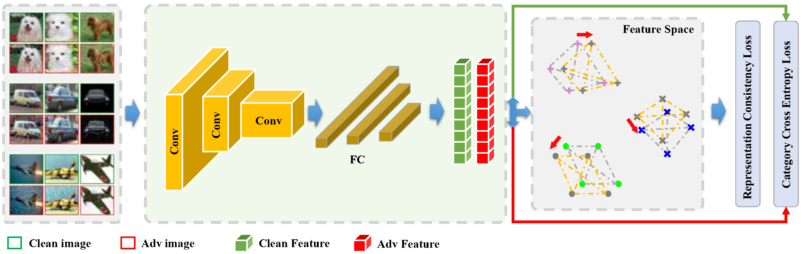
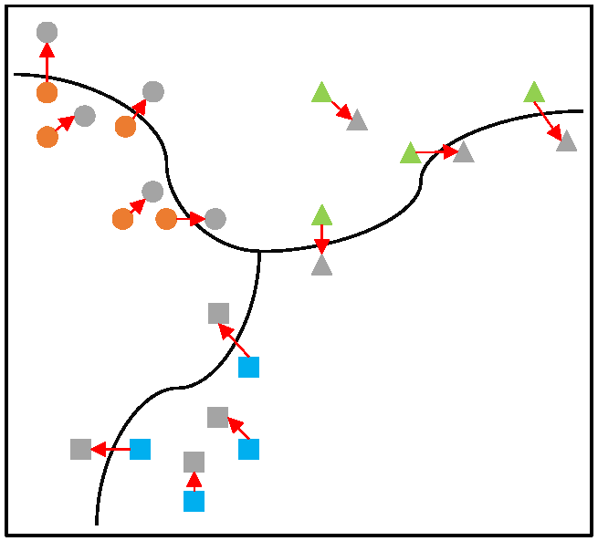
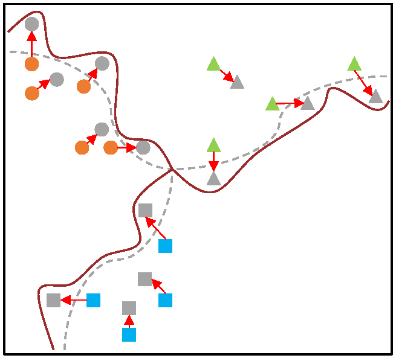
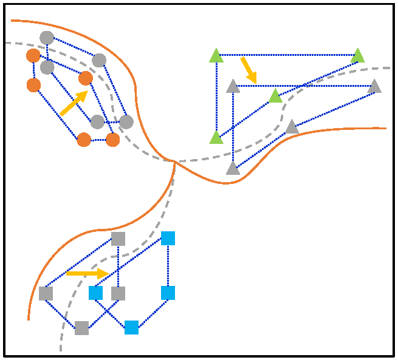

Overview
----

This repository is an implementation of the paper "Improving Adversarial Robustness of Deep Learning Models via Representation Consistency Constraints among Intra-class Examples".

Introduction
----

We develop an adversarial defense method based on representation consistency constraints, which explicitly promotes similarity between intra-class natural and adversarial examples. This approach significantly enhances the local generalization capability of the model’s decision boundaries and improves overall adversarial robustness.

The Proposed Method
----

In this paper, we measure the distance between example feature representations using the commonly adopted Euclidean distance. Specifically, we define $d\left[f_{\boldsymbol{\theta}}(\boldsymbol{x}_{i}), f_{\boldsymbol{\theta}}(\boldsymbol{x}_{j})\right]$ as the distance between the features of examples $\boldsymbol{x}_i$ and $\boldsymbol{x}_j$, where $f_{\boldsymbol{\theta}}(\cdot)$ denotes the feature extractor parameterized by $\boldsymbol{\theta}$. Based on this metric, we construct a pairwise distance matrix $\boldsymbol{M}_{\mathcal{D}} = \[d_{ij}\] \in \mathbb{R}^{B \times B}$, where $B$ is the number of samples in each mini-batch during training.

$$
d_{ij}\triangleq\sqrt{\left[f_{\boldsymbol{\theta}}(\boldsymbol{x}_{i})-f_{\boldsymbol{\theta}}(\boldsymbol{x}_{j})\right]^{T}\left[f_{\boldsymbol{\theta}}(\boldsymbol{x}_{i})-f_{\boldsymbol{\theta}}(\boldsymbol{x}_{j})\right]}
$$

To facilitate subsequent numerical computations, we apply the softmax function to each row of the distance matrix, transforming it into a normalized similarity matrix. The resulting matrix is denoted as $\boldsymbol{M_{S}} = [s_{ij}] \in \mathbb{R}^{B \times B}$, where each element $s_{ij}$ quantifies the similarity between sample $i$ and sample $j$ in the feature space.

$$
s_{ij}\triangleq\frac{{\rm exp}(d_{ij})}{\sum_{j=1}^{B}{\rm exp}(d_{ij})}
$$

Since this work focuses on capturing similarity relationships among examples within the same class, we explicitly eliminate cross-class similarities from the similarity matrix. Specifically, for any pair of examples $\boldsymbol{x}_i$ and $\boldsymbol{x}_j$ such that $\boldsymbol{y}_i \neq \boldsymbol{y}_j$, we set $s_{ij} = 0$. The resulting class-aware similarity matrix is denoted as $\boldsymbol{M}_{SC}$, which preserves only intra-class similarity relationships.

To explicitly enforce consistency in feature-space relationships between natural and adversarial examples, we introduce a representation consistency constraint based on the previously defined similarity measure. This constraint is integrated into the adversarial training objective as an additional regularization term.

$$
\mathcal{L}_{AT-RCC}(\boldsymbol{\theta};\boldsymbol{\mathcal{D}})\triangleq &
    \beta \mathcal{L}(\boldsymbol{\theta};\boldsymbol{\mathcal{D}})+(1-\beta)\mathcal{L}(\boldsymbol{\theta};\boldsymbol{\mathcal{D}}^{adv}) \\ & +\lambda \mathcal{L}(\boldsymbol{M}_{SC},\boldsymbol{M}^{adv}_{SC};\boldsymbol{\mathcal{D}},\boldsymbol{\mathcal{D}}^{adv})
$$

Here, $\boldsymbol{M}_{SC}$ and $\boldsymbol{M}_{SC}^{adv}$ denote the intra-class similarity matrices in the feature space for natural and adversarial examples, respectively. The term $\lambda$ is a weighting coefficient that controls the contribution of the representation consistency loss. The function $\mathcal{L}(\boldsymbol{M}_{SC}, \boldsymbol{M}_{SC}^{adv})$ quantifies the discrepancy between the two similarity matrices. Given that the batch size in typical training iterations ranges from tens to hundreds, we adopt cosine similarity to measure the dissimilarity between corresponding rows of $\boldsymbol{M}_{SC}$ and $\boldsymbol{M}_{SC}^{adv}$. Specifically, $\boldsymbol{r}_{i-\boldsymbol{M}}$ and $\boldsymbol{r}_{i-\boldsymbol{M}^{adv}}$ denote the $i$-th row vectors of the two matrices.

$$
\mathcal{L}(\boldsymbol{M}_{SC},\boldsymbol{M}^{adv}_{SC})\triangleq\frac{1}{B}\sum_{i=1}^{B}\left[1-\frac{\boldsymbol{r}_{i-\boldsymbol{M}}^{T}\boldsymbol{r}_{i-\boldsymbol{M}^{adv}}}{\|\boldsymbol{r}_{i-\boldsymbol{M}}\|\|\boldsymbol{r}_{i-\boldsymbol{M}^{adv}}\|}\right]
$$
